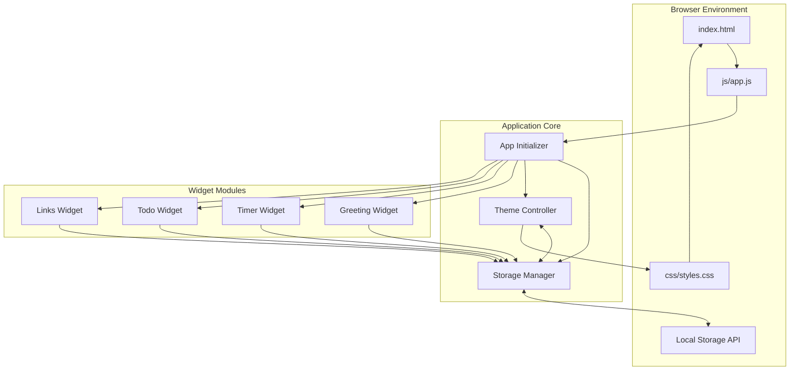
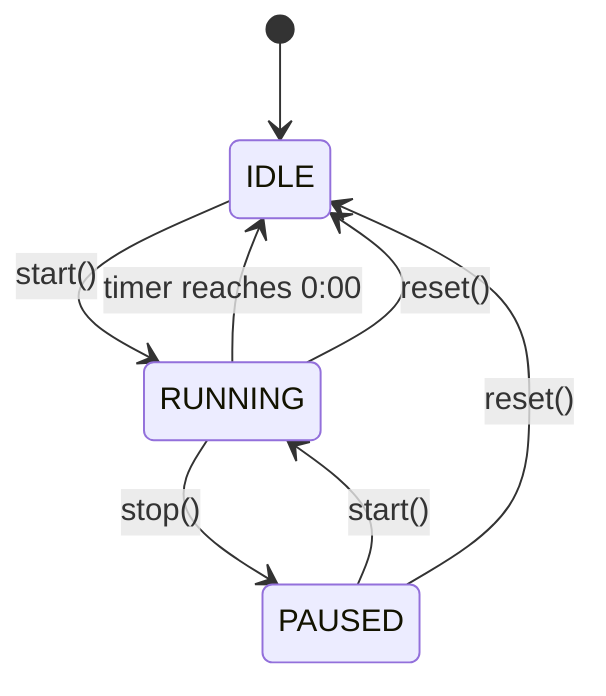
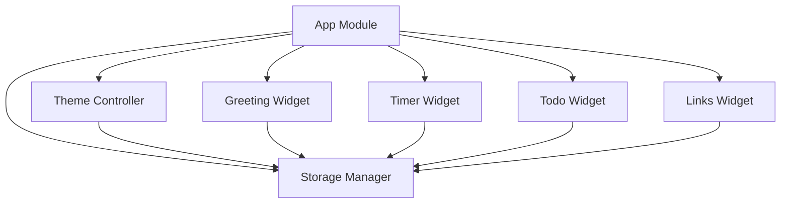

# Technical Design Document: To-Do List Life Dashboard

## Overview

The To-Do List Life Dashboard is a client-side single-page application (SPA) that provides a personal productivity hub combining four core widgets: a time-aware greeting, a Pomodoro focus timer, a task management system, and a quick-links launcher. The system is built entirely with vanilla JavaScript, HTML5, and CSS3, with no external framework dependencies. All user data persists locally using the browser's Local Storage API, making the application fully functional offline and requiring no backend infrastructure.

The design follows a modular architecture where each widget operates as an independent module with clearly defined responsibilities. A central Storage Manager handles all persistence operations, while a Theme Controller manages the visual appearance. The application initializes synchronously on page load, hydrating all widgets from Local Storage before rendering the first paint.

### Key Design Principles

1. **Module Independence**: Each widget is self-contained with minimal coupling to other components
2. **State Centralization**: All persistent state flows through the Storage Manager
3. **Progressive Enhancement**: The application works with or without Local Storage
4. **Single Responsibility**: Each module has one clearly defined purpose
5. **Declarative DOM Updates**: State changes trigger explicit DOM updates rather than direct manipulation

---

## Architecture

### System Architecture Diagram



### Module Structure

The application is organized into the following modules, each implemented as an ES6 module or IIFE (Immediately Invoked Function Expression) pattern for browser compatibility:

1. **StorageManager**: Centralized persistence layer for Local Storage operations
2. **ThemeController**: Manages light/dark theme switching and CSS class application
3. **GreetingWidget**: Displays time, date, and personalized greeting
4. **TimerWidget**: Implements Pomodoro countdown timer with state management
5. **TodoWidget**: Manages task list with CRUD operations and sorting
6. **LinksWidget**: Manages quick-access link shortcuts
7. **App**: Main application initializer and orchestrator

### Execution Flow

1. **Page Load**: Browser loads HTML, CSS, and JavaScript files
2. **Initialization**: App module instantiates all widgets and controllers
3. **Hydration**: StorageManager reads all persisted data from Local Storage
4. **Rendering**: Each widget receives its data and renders initial state
5. **Event Binding**: All user interaction handlers are attached
6. **Runtime**: User interactions trigger state updates that persist and re-render

---

## Components and Interfaces

### StorageManager Module

**Responsibility**: Provide a centralized, namespaced interface to Local Storage with error handling and fallback behavior.

**Public API**:

```javascript
const StorageManager = {
  // Read a value from storage
  get(key) -> any | null
  
  // Write a value to storage
  set(key, value) -> boolean
  
  // Remove a value from storage
  remove(key) -> boolean
  
  // Check if storage is available
  isAvailable() -> boolean
  
  // Get all keys with the namespace prefix
  getAll() -> Object
}
```

**Storage Keys** (all prefixed with `tld_`):

- `tld_tasks`: Array of task objects
- `tld_links`: Array of link objects
- `tld_userName`: String for personalized greeting
- `tld_pomoDuration`: Integer for Pomodoro duration in minutes
- `tld_theme`: String ('light' or 'dark')
- `tld_sortOrder`: String ('pending', 'completed', 'alpha')

**Implementation Details**:

- All values are serialized as JSON before storage
- Failed storage operations return `false` but do not throw
- A private `storageAvailable` flag tracks Local Storage availability
- All keys are prefixed with `tld_` to avoid collisions

**Error Handling**: If Local Storage is unavailable (private browsing, quota exceeded, or disabled), methods return null/false and the application continues with in-memory state.

---

### ThemeController Module

**Responsibility**: Manage the application's visual theme by toggling CSS classes and persisting the user's preference.

**Public API**:

```javascript
const ThemeController = {
  // Initialize theme from storage or default
  init() -> void
  
  // Toggle between light and dark themes
  toggle() -> void
  
  // Get current theme
  getCurrentTheme() -> 'light' | 'dark'
  
  // Apply a specific theme
  applyTheme(theme) -> void
}
```

**Implementation Details**:

- Applies theme by adding/removing a `dark-theme` class on `<body>`
- CSS uses this class to override light theme variables
- Default theme is `light` if no preference exists
- Theme changes persist immediately via StorageManager

**CSS Integration**:

```css
:root {
  --bg-primary: #ffffff;
  --bg-secondary: #f5f5f5;
  --text-primary: #333333;
  --text-secondary: #666666;
  --accent: #007bff;
  --border: #dddddd;
}

body.dark-theme {
  --bg-primary: #1a1a1a;
  --bg-secondary: #2a2a2a;
  --text-primary: #ffffff;
  --text-secondary: #cccccc;
  --accent: #4da6ff;
  --border: #444444;
}
```

---

### GreetingWidget Module

**Responsibility**: Display current time, date, and personalized greeting with time-of-day awareness.

**Public API**:

```javascript
const GreetingWidget = {
  // Initialize the widget
  init(containerSelector) -> void
  
  // Update the displayed time
  updateTime() -> void
  
  // Set/update user name
  setUserName(name) -> void
}
```

**DOM Structure**:

```html
<div id="greeting-widget" class="widget">
  <div class="greeting-time" id="greeting-time">12:45</div>
  <div class="greeting-date" id="greeting-date">Monday, October 26, 2026</div>
  <div class="greeting-message" id="greeting-message">Good afternoon, Giovanni!</div>
  <input type="text" id="greeting-name-input" placeholder="Enter your name" />
</div>
```

**Implementation Details**:

- Uses `setInterval` with 60-second interval to update time
- Calculates greeting prefix based on current hour (5-11: morning, 12-17: afternoon, 18-4: evening)
- Formats date using `toLocaleDateString` with appropriate options
- Name input debounces saves to StorageManager (500ms delay)
- Initializes with stored name on load

**State Management**:

- Internal state: `currentUserName` (string)
- Persisted state: `tld_userName` in Local Storage
- Time update interval: stored as private variable for cleanup

---

### TimerWidget Module

**Responsibility**: Implement a Pomodoro countdown timer with start/stop/reset controls and configurable duration.

**Public API**:

```javascript
const TimerWidget = {
  // Initialize the widget
  init(containerSelector) -> void
  
  // Start or resume the timer
  start() -> void
  
  // Pause the timer
  stop() -> void
  
  // Reset the timer to full duration
  reset() -> void
  
  // Set custom duration
  setDuration(minutes) -> boolean
}
```

**DOM Structure**:

```html
<div id="timer-widget" class="widget">
  <h2>Focus Timer</h2>
  <div class="timer-display" id="timer-display">25:00</div>
  <div class="timer-controls">
    <button id="timer-start" class="btn-primary">Start</button>
    <button id="timer-stop" class="btn-secondary" disabled>Stop</button>
    <button id="timer-reset" class="btn-secondary">Reset</button>
  </div>
  <div class="timer-config">
    <label for="timer-duration">Duration (minutes):</label>
    <input type="number" id="timer-duration" min="1" max="60" value="25" />
    <span class="error-message" id="timer-error"></span>
  </div>
</div>
```

**State Machine**:

The timer operates in three states:

1. **IDLE**: Timer is at full duration, not running
   - Start button: enabled
   - Stop button: disabled
   - Display: shows full duration

2. **RUNNING**: Timer is actively counting down
   - Start button: disabled
   - Stop button: enabled
   - Display: updates every second

3. **PAUSED**: Timer is stopped with remaining time
   - Start button: enabled (resume)
   - Stop button: disabled
   - Display: shows remaining time

**State Transitions**:



**Implementation Details**:

- Uses `setInterval` with 1-second intervals when running
- Stores interval ID for cleanup
- Time remaining tracked in seconds internally
- Display format: `MM:SS` padded with zeros
- On completion (0:00), plays browser notification and auto-resets
- Duration validation: rejects non-numeric or out-of-range values
- Custom duration persists via StorageManager

**State Variables**:

- `timerState`: 'idle' | 'running' | 'paused'
- `totalDuration`: integer (seconds)
- `remainingTime`: integer (seconds)
- `intervalId`: reference to active interval or null

---

### TodoWidget Module

**Responsibility**: Manage a task list with add, edit, complete, delete, and sort operations, preventing duplicate entries.

**Public API**:

```javascript
const TodoWidget = {
  // Initialize the widget
  init(containerSelector) -> void
  
  // Add a new task
  addTask(description) -> boolean
  
  // Toggle task completion
  toggleTask(taskId) -> void
  
  // Edit task description
  editTask(taskId, newDescription) -> boolean
  
  // Delete a task
  deleteTask(taskId) -> void
  
  // Set sort order
  setSortOrder(order) -> void
  
  // Render task list
  render() -> void
}
```

**DOM Structure**:

```html
<div id="todo-widget" class="widget">
  <h2>Tasks</h2>
  <div class="todo-input-group">
    <input type="text" id="todo-input" placeholder="Add a new task..." />
    <button id="todo-add" class="btn-primary">Add</button>
    <span class="error-message" id="todo-error"></span>
  </div>
  <div class="todo-sort">
    <label for="todo-sort-select">Sort by:</label>
    <select id="todo-sort-select">
      <option value="pending">Pending first</option>
      <option value="completed">Completed first</option>
      <option value="alpha">Alphabetical (A-Z)</option>
    </select>
  </div>
  <ul id="todo-list" class="todo-list">
    <!-- Task items rendered dynamically -->
  </ul>
</div>
```

**Task Item DOM Structure**:

```html
<li class="todo-item" data-task-id="unique-id">
  <input type="checkbox" class="todo-checkbox" />
  <span class="todo-text">Task description</span>
  <div class="todo-actions">
    <button class="todo-edit btn-icon">Edit</button>
    <button class="todo-delete btn-icon">Delete</button>
  </div>
</li>

<!-- During edit mode -->
<li class="todo-item todo-editing" data-task-id="unique-id">
  <input type="text" class="todo-edit-input" value="Task description" />
  <div class="todo-actions">
    <button class="todo-save btn-icon">Save</button>
    <button class="todo-cancel btn-icon">Cancel</button>
  </div>
  <span class="error-message"></span>
</li>
```

**Data Model** (Task):

```javascript
{
  id: string,              // UUID or timestamp-based unique identifier
  description: string,     // Task text content
  completed: boolean,      // Completion status
  createdAt: number        // Timestamp for potential future use
}
```

**Implementation Details**:

- Each task has a unique ID generated using `crypto.randomUUID()` or timestamp fallback
- Duplicate detection: case-insensitive comparison of trimmed descriptions
- Edit mode: replaces task text with input field, validates on save
- Sort orders applied in-memory before rendering, original order preserved in storage
- Empty input validation on both add and edit operations
- All mutations trigger immediate persistence via StorageManager

**Sort Logic**:

1. **Pending First**: `!task.completed` before `task.completed`, stable sort
2. **Completed First**: `task.completed` before `!task.completed`, stable sort
3. **Alphabetical**: `task.description.toLowerCase()` lexicographic sort

**Error Handling**:

- Empty task: "Task description cannot be empty"
- Duplicate task: "This task already exists in your list"
- Errors display inline for 3 seconds then clear

---

### LinksWidget Module

**Responsibility**: Manage quick-access website links with label and URL, ensuring valid URLs.

**Public API**:

```javascript
const LinksWidget = {
  // Initialize the widget
  init(containerSelector) -> void
  
  // Add a new link
  addLink(label, url) -> boolean
  
  // Delete a link
  deleteLink(linkId) -> void
  
  // Open a link in new tab
  openLink(url) -> void
  
  // Render link list
  render() -> void
}
```

**DOM Structure**:

```html
<div id="links-widget" class="widget">
  <h2>Quick Links</h2>
  <div class="links-input-group">
    <input type="text" id="link-label" placeholder="Label..." />
    <input type="text" id="link-url" placeholder="URL..." />
    <button id="link-add" class="btn-primary">Add</button>
    <span class="error-message" id="link-error"></span>
  </div>
  <div id="links-container" class="links-container">
    <!-- Link buttons rendered dynamically -->
  </div>
</div>
```

**Link Button DOM Structure**:

```html
<div class="link-item" data-link-id="unique-id">
  <button class="link-button">Label</button>
  <button class="link-delete btn-icon">×</button>
</div>
```

**Data Model** (Link):

```javascript
{
  id: string,          // UUID or timestamp-based unique identifier
  label: string,       // Display text for the link
  url: string,         // Full URL including protocol
  createdAt: number    // Timestamp for creation order
}
```

**Implementation Details**:

- URL normalization: prepends `https://` if protocol is missing
- Basic URL validation: checks for valid URL format after normalization
- Links open in new tab using `window.open(url, '_blank', 'noopener,noreferrer')`
- Renders links in creation order (by `createdAt`)
- Empty field validation: both label and URL required
- All mutations trigger immediate persistence via StorageManager

**URL Normalization Logic**:

```javascript
function normalizeUrl(url) {
  url = url.trim();
  if (!url.startsWith('http://') && !url.startsWith('https://')) {
    url = 'https://' + url;
  }
  return url;
}
```

**Error Handling**:

- Empty label: "Both label and URL are required"
- Empty URL: "Both label and URL are required"
- Errors display inline for 3 seconds then clear

---

### App Module (Initializer)

**Responsibility**: Orchestrate application startup by initializing all modules in the correct order and establishing the global event loop.

**Public API**:

```javascript
const App = {
  // Initialize entire application
  init() -> void
}
```

**Initialization Sequence**:

1. Check StorageManager availability
2. Initialize ThemeController and apply persisted theme
3. Initialize GreetingWidget with time updates
4. Initialize TimerWidget with persisted duration
5. Initialize TodoWidget with persisted tasks
6. Initialize LinksWidget with persisted links
7. Bind global event listeners (theme toggle)
8. Mark application as ready

**DOM Ready Detection**:

```javascript
if (document.readyState === 'loading') {
  document.addEventListener('DOMContentLoaded', App.init);
} else {
  App.init();
}
```

---

## Data Models

### Task Model

```typescript
interface Task {
  id: string;              // Unique identifier (UUID or timestamp)
  description: string;     // Task text (non-empty, trimmed)
  completed: boolean;      // Completion state
  createdAt: number;       // Unix timestamp (milliseconds)
}
```

**Validation Rules**:

- `id`: Must be unique within the task list
- `description`: 1-500 characters, trimmed, non-whitespace
- `completed`: Boolean value only
- `createdAt`: Valid Unix timestamp

**Example**:

```json
{
  "id": "550e8400-e29b-41d4-a716-446655440000",
  "description": "Review pull requests",
  "completed": false,
  "createdAt": 1698264000000
}
```

---

### Link Model

```typescript
interface Link {
  id: string;          // Unique identifier (UUID or timestamp)
  label: string;       // Display label for the link
  url: string;         // Fully qualified URL with protocol
  createdAt: number;   // Unix timestamp (milliseconds)
}
```

**Validation Rules**:

- `id`: Must be unique within the link list
- `label`: 1-100 characters, trimmed
- `url`: Valid URL format with protocol (http:// or https://)
- `createdAt`: Valid Unix timestamp

**Example**:

```json
{
  "id": "550e8400-e29b-41d4-a716-446655440001",
  "label": "GitHub",
  "url": "https://github.com",
  "createdAt": 1698264000000
}
```

---

### Storage Schema

All data is stored in Local Storage as JSON-serialized strings under namespaced keys.

**Complete Storage Schema**:

```typescript
{
  // Task list
  "tld_tasks": Task[],
  
  // Link list
  "tld_links": Link[],
  
  // User preferences
  "tld_userName": string,
  "tld_pomoDuration": number,      // Minutes (1-60)
  "tld_theme": "light" | "dark",
  "tld_sortOrder": "pending" | "completed" | "alpha"
}
```

**Example Storage State**:

```json
{
  "tld_tasks": "[{\"id\":\"abc123\",\"description\":\"Write design doc\",\"completed\":false,\"createdAt\":1698264000000}]",
  "tld_links": "[{\"id\":\"def456\",\"label\":\"GitHub\",\"url\":\"https://github.com\",\"createdAt\":1698264000000}]",
  "tld_userName": "Giovanni",
  "tld_pomoDuration": "25",
  "tld_theme": "dark",
  "tld_sortOrder": "pending"
}
```

**Storage Key Rationale**:

- `tld_` prefix prevents collisions with other applications
- Short prefix minimizes storage overhead
- Descriptive suffixes improve developer experience
- All keys use snake_case for consistency

---

## DOM Structure and Widget Organization

### HTML Document Structure

```html
<!DOCTYPE html>
<html lang="en">
<head>
  <meta charset="UTF-8">
  <meta name="viewport" content="width=device-width, initial-scale=1.0">
  <title>Life Dashboard</title>
  <link rel="stylesheet" href="css/styles.css">
</head>
<body>
  <div class="app-container">
    <!-- Header with theme toggle -->
    <header class="app-header">
      <h1>Life Dashboard</h1>
      <button id="theme-toggle" class="btn-icon" aria-label="Toggle theme">
        <span class="theme-icon">🌙</span>
      </button>
    </header>
    
    <!-- Main content area with widgets -->
    <main class="app-main">
      <!-- Top row: Greeting and Timer -->
      <div class="widget-row">
        <div id="greeting-widget" class="widget widget-greeting">
          <!-- Greeting widget content -->
        </div>
        <div id="timer-widget" class="widget widget-timer">
          <!-- Timer widget content -->
        </div>
      </div>
      
      <!-- Bottom row: Todo and Links -->
      <div class="widget-row">
        <div id="todo-widget" class="widget widget-todo">
          <!-- Todo widget content -->
        </div>
        <div id="links-widget" class="widget widget-links">
          <!-- Links widget content -->
        </div>
      </div>
    </main>
  </div>
  
  <script src="js/app.js"></script>
</body>
</html>
```

### CSS Grid Layout

The dashboard uses CSS Grid for responsive layout:

```css
.app-main {
  display: grid;
  grid-template-columns: repeat(auto-fit, minmax(400px, 1fr));
  gap: 1.5rem;
  padding: 2rem;
}

.widget-row {
  display: grid;
  grid-template-columns: repeat(auto-fit, minmax(300px, 1fr));
  gap: 1.5rem;
}

.widget {
  background: var(--bg-secondary);
  border: 1px solid var(--border);
  border-radius: 8px;
  padding: 1.5rem;
  box-shadow: 0 2px 4px rgba(0,0,0,0.1);
}
```

**Responsive Breakpoints**:

- Desktop (>1200px): 2x2 grid layout
- Tablet (768px-1200px): 2-column layout with stacking
- Mobile (<768px): Single-column stack

---

## JavaScript Module Design and Responsibilities

### Module Pattern

Each module follows the Revealing Module Pattern for encapsulation:

```javascript
const ModuleName = (function() {
  // Private variables and functions
  let privateState = null;
  
  function privateHelper() {
    // Internal logic
  }
  
  // Public API
  return {
    init() {
      // Public method
    },
    publicMethod() {
      // Public method
    }
  };
})();
```

### Dependency Graph



**Module Responsibilities**:

1. **App Module**: 
   - Application lifecycle management
   - Module initialization orchestration
   - Global error handling

2. **StorageManager**: 
   - Local Storage I/O operations
   - Data serialization/deserialization
   - Storage availability detection

3. **ThemeController**: 
   - CSS class management for themes
   - Theme state persistence
   - Theme initialization

4. **GreetingWidget**: 
   - Time/date display and formatting
   - Greeting message calculation
   - User name management

5. **TimerWidget**: 
   - Timer state machine logic
   - Interval management
   - Duration configuration

6. **TodoWidget**: 
   - Task CRUD operations
   - Duplicate detection
   - Sort algorithm application

7. **LinksWidget**: 
   - Link CRUD operations
   - URL normalization and validation
   - Link navigation

---

## CSS Organization and Theming Approach

### File Structure

```
css/
└── styles.css
    ├── CSS Variables (Theme tokens)
    ├── Reset/Base styles
    ├── Layout (Grid, Container)
    ├── Component styles (Widgets)
    ├── Button styles
    ├── Form elements
    ├── Utility classes
    └── Dark theme overrides
```

### CSS Variable System

**Light Theme (Default)**:

```css
:root {
  /* Colors */
  --bg-primary: #ffffff;
  --bg-secondary: #f8f9fa;
  --bg-tertiary: #e9ecef;
  --text-primary: #212529;
  --text-secondary: #6c757d;
  --text-muted: #adb5bd;
  
  /* Accent colors */
  --accent-primary: #007bff;
  --accent-hover: #0056b3;
  --accent-light: #cce5ff;
  
  /* Semantic colors */
  --success: #28a745;
  --error: #dc3545;
  --warning: #ffc107;
  
  /* UI elements */
  --border-color: #dee2e6;
  --shadow: rgba(0, 0, 0, 0.1);
  
  /* Spacing */
  --spacing-xs: 0.25rem;
  --spacing-sm: 0.5rem;
  --spacing-md: 1rem;
  --spacing-lg: 1.5rem;
  --spacing-xl: 2rem;
  
  /* Typography */
  --font-family: -apple-system, BlinkMacSystemFont, "Segoe UI", Roboto, sans-serif;
  --font-size-base: 16px;
  --font-size-sm: 14px;
  --font-size-lg: 18px;
  --font-size-xl: 24px;
  
  /* Border radius */
  --radius-sm: 4px;
  --radius-md: 8px;
  --radius-lg: 12px;
}
```

**Dark Theme Overrides**:

```css
body.dark-theme {
  --bg-primary: #1a1a1a;
  --bg-secondary: #2d2d2d;
  --bg-tertiary: #3a3a3a;
  --text-primary: #ffffff;
  --text-secondary: #b0b0b0;
  --text-muted: #6c6c6c;
  
  --accent-primary: #4da6ff;
  --accent-hover: #66b3ff;
  --accent-light: #1a3a52;
  
  --success: #5cb85c;
  --error: #e74c3c;
  --warning: #f39c12;
  
  --border-color: #404040;
  --shadow: rgba(0, 0, 0, 0.3);
}
```

### Component CSS Structure

Each widget follows consistent class naming:

```css
/* Widget container */
.widget { }

/* Widget-specific container */
.widget-greeting { }
.widget-timer { }
.widget-todo { }
.widget-links { }

/* Widget elements use BEM-like naming */
.todo-input-group { }
.todo-list { }
.todo-item { }
.todo-item.completed { }
.todo-edit-input { }
.todo-actions { }
```

### Button System

```css
/* Base button */
.btn {
  padding: var(--spacing-sm) var(--spacing-md);
  border: none;
  border-radius: var(--radius-sm);
  font-size: var(--font-size-base);
  cursor: pointer;
  transition: all 0.2s ease;
}

/* Primary action button */
.btn-primary {
  background: var(--accent-primary);
  color: white;
}

.btn-primary:hover {
  background: var(--accent-hover);
}

.btn-primary:disabled {
  background: var(--text-muted);
  cursor: not-allowed;
}

/* Secondary button */
.btn-secondary {
  background: var(--bg-tertiary);
  color: var(--text-primary);
}

/* Icon button (small, square) */
.btn-icon {
  width: 32px;
  height: 32px;
  padding: 0;
  display: flex;
  align-items: center;
  justify-content: center;
}
```

---

## Event Handling and State Management Patterns

### Event Delegation

Widgets use event delegation for dynamic content:

```javascript
// TodoWidget example
function init(containerSelector) {
  const container = document.querySelector(containerSelector);
  const list = container.querySelector('#todo-list');
  
  // Single event listener on parent, delegates to children
  list.addEventListener('click', (e) => {
    const taskItem = e.target.closest('.todo-item');
    if (!taskItem) return;
    
    const taskId = taskItem.dataset.taskId;
    
    if (e.target.matches('.todo-checkbox')) {
      toggleTask(taskId);
    } else if (e.target.matches('.todo-delete')) {
      deleteTask(taskId);
    } else if (e.target.matches('.todo-edit')) {
      enterEditMode(taskId);
    }
  });
}
```

### State Management Pattern

Each widget maintains internal state synchronized with Local Storage:

```javascript
const TodoWidget = (function() {
  // Internal state (source of truth during session)
  let tasks = [];
  let currentSortOrder = 'pending';
  
  // State mutation functions
  function addTask(description) {
    // 1. Validate input
    if (!validateInput(description)) return false;
    
    // 2. Update internal state
    const newTask = createTask(description);
    tasks.push(newTask);
    
    // 3. Persist to storage
    StorageManager.set('tasks', tasks);
    
    // 4. Update UI
    render();
    
    return true;
  }
  
  // State hydration on init
  function init(containerSelector) {
    // Load persisted state
    tasks = StorageManager.get('tasks') || [];
    currentSortOrder = StorageManager.get('sortOrder') || 'pending';
    
    // Render initial state
    render();
    
    // Bind event handlers
    bindEvents();
  }
  
  return { init, addTask, /* ... */ };
})();
```

**State Flow**:

1. User interaction triggers event handler
2. Handler validates input and updates internal state
3. State change persists to Local Storage via StorageManager
4. DOM updates reflect new state via render function

### Timer State Machine Implementation

```javascript
const TimerWidget = (function() {
  const STATES = {
    IDLE: 'idle',
    RUNNING: 'running',
    PAUSED: 'paused'
  };
  
  let state = STATES.IDLE;
  let totalDuration = 25 * 60;  // seconds
  let remainingTime = totalDuration;
  let intervalId = null;
  
  function start() {
    if (state === STATES.RUNNING) return;
    
    state = STATES.RUNNING;
    updateControls();
    
    intervalId = setInterval(() => {
      remainingTime--;
      updateDisplay();
      
      if (remainingTime <= 0) {
        complete();
      }
    }, 1000);
  }
  
  function stop() {
    if (state !== STATES.RUNNING) return;
    
    clearInterval(intervalId);
    intervalId = null;
    state = STATES.PAUSED;
    updateControls();
  }
  
  function reset() {
    if (intervalId) {
      clearInterval(intervalId);
      intervalId = null;
    }
    
    state = STATES.IDLE;
    remainingTime = totalDuration;
    updateDisplay();
    updateControls();
  }
  
  function complete() {
    clearInterval(intervalId);
    intervalId = null;
    state = STATES.IDLE;
    
    // Notify user
    notifyComplete();
    
    // Auto-reset
    reset();
  }
  
  function updateControls() {
    const startBtn = document.querySelector('#timer-start');
    const stopBtn = document.querySelector('#timer-stop');
    
    startBtn.disabled = state === STATES.RUNNING;
    stopBtn.disabled = state !== STATES.RUNNING;
  }
  
  return { init, start, stop, reset, setDuration };
})();
```

### Error Display Pattern

All widgets use consistent error display:

```javascript
function showError(message, elementId) {
  const errorEl = document.querySelector(`#${elementId}`);
  errorEl.textContent = message;
  errorEl.style.display = 'block';
  
  // Auto-clear after 3 seconds
  setTimeout(() => {
    errorEl.textContent = '';
    errorEl.style.display = 'none';
  }, 3000);
}
```

---

## File Structure

```
todo-life-dashboard/
├── index.html           # Main HTML document
├── css/
│   └── styles.css       # All application styles
└── js/
    └── app.js           # All JavaScript modules
```

### index.html Structure

- Single HTML5 document
- Semantic HTML structure
- Links to external CSS and JS
- Contains all widget container elements
- No inline styles or scripts

### css/styles.css Organization

1. CSS custom properties (variables)
2. CSS reset and base styles
3. Layout and grid system
4. Widget component styles
5. Button and form styles
6. Utility classes
7. Dark theme overrides
8. Responsive media queries

### js/app.js Module Order

```javascript
// 1. StorageManager
const StorageManager = (function() { /* ... */ })();

// 2. ThemeController
const ThemeController = (function() { /* ... */ })();

// 3. GreetingWidget
const GreetingWidget = (function() { /* ... */ })();

// 4. TimerWidget
const TimerWidget = (function() { /* ... */ })();

// 5. TodoWidget
const TodoWidget = (function() { /* ... */ })();

// 6. LinksWidget
const LinksWidget = (function() { /* ... */ })();

// 7. App (Initializer)
const App = (function() { /* ... */ })();

// 8. Bootstrap
if (document.readyState === 'loading') {
  document.addEventListener('DOMContentLoaded', App.init);
} else {
  App.init();
}
```

**Module Dependencies**:

- Modules defined in dependency order (dependencies first)
- StorageManager has no dependencies (foundation)
- All widgets depend on StorageManager
- App depends on all other modules
- No circular dependencies

---

## Correctness Properties

*A property is a characteristic or behavior that should hold true across all valid executions of a system—essentially, a formal statement about what the system should do. Properties serve as the bridge between human-readable specifications and machine-verifiable correctness guarantees.*

Now I'll analyze the acceptance criteria for testability using the prework tool:

<function_calls>
<invoke name="prework">
<parameter name="featureName">todo-life-dashboard

### Property 1: Date Formatting Correctness

*For any* valid JavaScript Date object, the Greeting Widget's date formatter SHALL produce a string in the format "Day-of-Week, Month Day, Year" (e.g., "Monday, October 26, 2026").

**Validates: Requirements 2.1**

---

### Property 2: Time Formatting Correctness

*For any* valid time values (hours 0-23, minutes 0-59), the Greeting Widget's time formatter SHALL produce a string in HH:MM format with proper zero-padding.

**Validates: Requirements 2.2**

---

### Property 3: Time-Based Greeting Correctness

*For any* hour value in the range [5, 11], the greeting prefix SHALL be "Good morning". *For any* hour value in the range [12, 17], the greeting prefix SHALL be "Good afternoon". *For any* hour value in the range [18, 23] or [0, 4], the greeting prefix SHALL be "Good evening".

**Validates: Requirements 2.3, 2.4, 2.5**

---

### Property 4: Name Persistence Round-Trip

*For any* non-empty name string, saving the name through the Greeting Widget and then reloading the dashboard SHALL restore the exact same name in the greeting message.

**Validates: Requirements 3.2, 3.4, 3.5**

---

### Property 5: Timer Display Format Correctness

*For any* duration value in seconds, the Timer Widget SHALL display it in MM:SS format with proper zero-padding (e.g., 1500 seconds displays as "25:00").

**Validates: Requirements 4.1**

---

### Property 6: Timer Pause Preserves State

*For any* remaining time value when the timer is running, activating the Stop control SHALL preserve the exact remaining time without decrement.

**Validates: Requirements 4.3**

---

### Property 7: Timer Resume Continuity

*For any* paused timer state with remaining time T, activating the Start control SHALL resume countdown from exactly time T.

**Validates: Requirements 4.4**

---

### Property 8: Timer Reset Restoration

*For any* timer state (idle, running, or paused), activating the Reset control SHALL restore the timer to the full configured Pomodoro duration and idle state.

**Validates: Requirements 4.5**

---

### Property 9: Timer Button State Consistency

*For any* timer state, the enabled/disabled states of Start and Stop buttons SHALL match the state: Start disabled when running, Stop disabled when not running.

**Validates: Requirements 4.7**

---

### Property 10: Timer Duration Update Correctness

*For any* valid duration value (1-60 minutes), submitting it through the Timer Widget SHALL update the timer display to show that duration in MM:SS format.

**Validates: Requirements 5.2**

---

### Property 11: Timer Duration Validation

*For any* invalid duration input (non-numeric, less than 1, greater than 60), the Timer Widget SHALL reject the input and display an error message without updating the timer.

**Validates: Requirements 5.3**

---

### Property 12: Timer Duration Persistence Round-Trip

*For any* valid Pomodoro duration (1-60 minutes), saving the duration and reloading the dashboard SHALL restore the timer to that exact duration.

**Validates: Requirements 5.4, 5.5**

---

### Property 13: Task Addition Correctness

*For any* non-empty, non-whitespace task description that is unique in the current task list, adding it through the Todo Widget SHALL result in a new task appearing in both the displayed list and Local Storage.

**Validates: Requirements 6.2**

---

### Property 14: Empty Task Rejection

*For any* string composed entirely of whitespace characters (including empty string), attempting to add it as a task SHALL be rejected without modifying the task list.

**Validates: Requirements 6.3**

---

### Property 15: Task Completion Toggle

*For any* task in the list, activating the complete control SHALL toggle the task's completion status from false to true or true to false.

**Validates: Requirements 6.4**

---

### Property 16: Task Deletion Correctness

*For any* task with ID T in the task list, activating the delete control for task T SHALL remove that task from both the displayed list and Local Storage, with all other tasks remaining unchanged.

**Validates: Requirements 6.5**

---

### Property 17: Task Edit Correctness

*For any* task with ID T and any valid new description D that is unique in the list, editing task T to description D SHALL update the task's description in both the displayed list and Local Storage.

**Validates: Requirements 6.6, 6.7**

---

### Property 18: Task List Persistence Round-Trip

*For any* collection of tasks (with varying descriptions and completion states), saving them through the Todo Widget and reloading the dashboard SHALL restore exactly the same tasks with the same completion states.

**Validates: Requirements 6.8**

---

### Property 19: Duplicate Task Prevention (Add)

*For any* task description D that matches an existing task's description (case-insensitive comparison), attempting to add a new task with description D SHALL be rejected with an error message.

**Validates: Requirements 7.1**

---

### Property 20: Duplicate Task Prevention (Edit)

*For any* task being edited with ID T and any description D that matches a different existing task's description (case-insensitive), attempting to save task T with description D SHALL be rejected with an error message.

**Validates: Requirements 7.2, 7.3**

---

### Property 21: Pending-First Sort Ordering

*For any* task list containing both completed and incomplete tasks, applying the "Pending first" sort order SHALL result in all incomplete tasks appearing before all completed tasks in the display.

**Validates: Requirements 8.2**

---

### Property 22: Completed-First Sort Ordering

*For any* task list containing both completed and incomplete tasks, applying the "Completed first" sort order SHALL result in all completed tasks appearing before all incomplete tasks in the display.

**Validates: Requirements 8.3**

---

### Property 23: Alphabetical Sort Ordering

*For any* task list with varying descriptions, applying the "Alphabetical (A-Z)" sort order SHALL result in tasks displayed in lexicographic order by description (case-insensitive).

**Validates: Requirements 8.4**

---

### Property 24: Sort Stability on Modification

*For any* active sort order and any task operation (add, edit, delete, toggle completion), the task list SHALL remain sorted according to the active sort order after the operation completes.

**Validates: Requirements 8.5**

---

### Property 25: Sort Preference Persistence Round-Trip

*For any* sort order selection ("pending", "completed", or "alpha"), saving the preference and reloading the dashboard SHALL restore that exact sort order as the active sort.

**Validates: Requirements 8.6**

---

### Property 26: Link Addition Correctness

*For any* non-empty label L and non-empty URL U, adding a link through the Links Widget SHALL result in a new link with label L and normalized URL U appearing in both the displayed list and Local Storage.

**Validates: Requirements 9.2**

---

### Property 27: Empty Link Field Rejection

*For any* link submission where either the label or URL field is empty or whitespace-only, the Links Widget SHALL reject the submission and display an error message.

**Validates: Requirements 9.3**

---

### Property 28: Link Deletion Correctness

*For any* link with ID L in the link list, activating the delete control for link L SHALL remove that link from both the displayed list and Local Storage, with all other links remaining unchanged.

**Validates: Requirements 9.5**

---

### Property 29: Link List Persistence Round-Trip

*For any* collection of links (with varying labels and URLs), saving them through the Links Widget and reloading the dashboard SHALL restore exactly the same links with the same labels and URLs.

**Validates: Requirements 9.6**

---

### Property 30: URL Normalization

*For any* URL string U that does not begin with "http://" or "https://", the Links Widget SHALL automatically prepend "https://" to U before storing and displaying the link.

**Validates: Requirements 9.7**

---

### Property 31: Theme Toggle Correctness

*For any* current theme state (light or dark), activating the theme toggle control SHALL switch the theme to the opposite state (dark to light, light to dark).

**Validates: Requirements 10.2**

---

### Property 32: Theme Application Correctness

*For any* theme selection (light or dark), applying the theme SHALL result in the corresponding CSS class ("dark-theme" or no class) being present on the document body element.

**Validates: Requirements 10.3**

---

### Property 33: Theme Persistence Round-Trip

*For any* theme selection (light or dark), saving the theme and reloading the dashboard SHALL restore that exact theme as the active theme.

**Validates: Requirements 10.4, 10.5**

---

### Property 34: Storage Key Namespace Correctness

*For any* data value persisted by the Storage Manager, the Local Storage key SHALL begin with the prefix "tld_" to ensure namespace isolation.

**Validates: Requirements 11.4**

---

### Property 35: Comprehensive Data Persistence

*For any* change to user data (tasks, links, name, duration, theme, or sort order), the Storage Manager SHALL immediately persist that change to Local Storage under the appropriate namespaced key.

**Validates: Requirements 11.1**

---

### Property 36: Complete State Restoration

*For any* complete application state (all tasks, all links, user name, timer duration, theme, and sort order), persisting the state and reloading the dashboard SHALL restore exactly the same state across all widgets.

**Validates: Requirements 11.2**

---

## Error Handling

### Storage Failures

**Scenario**: Local Storage is unavailable (private browsing, quota exceeded, disabled)

**Handling**:
- StorageManager detects unavailability during initialization
- All `get()` operations return `null` or default values
- All `set()` operations return `false` silently without throwing
- Application continues with in-memory state only
- User data persists for the current session but not across reloads

**Implementation**:

```javascript
function storageAvailable() {
  try {
    const test = '__storage_test__';
    localStorage.setItem(test, test);
    localStorage.removeItem(test);
    return true;
  } catch (e) {
    return false;
  }
}
```

### Invalid User Input

**Scenarios**:

1. **Empty Task Description**:
   - Validation: Trim and check for non-zero length
   - Error Message: "Task description cannot be empty"
   - Action: Reject input, clear input field

2. **Duplicate Task**:
   - Validation: Case-insensitive comparison against existing tasks
   - Error Message: "This task already exists in your list"
   - Action: Reject input, focus input field

3. **Invalid Timer Duration**:
   - Validation: Check for integer between 1 and 60
   - Error Message: "Duration must be between 1 and 60 minutes"
   - Action: Reject input, restore previous valid value

4. **Empty Link Fields**:
   - Validation: Check both label and URL for non-empty trimmed values
   - Error Message: "Both label and URL are required"
   - Action: Reject input, focus first empty field

### Runtime Errors

**Timer Interval Cleanup**:

```javascript
// Ensure intervals are cleaned up to prevent memory leaks
window.addEventListener('beforeunload', () => {
  if (timerIntervalId) {
    clearInterval(timerIntervalId);
  }
  if (greetingIntervalId) {
    clearInterval(greetingIntervalId);
  }
});
```

**DOM Element Not Found**:

- All widget init functions validate that container elements exist
- If container missing, log warning to console and skip widget initialization
- Other widgets continue to function normally

**Invalid Persisted Data**:

- On load, validate structure of data from Local Storage
- If data is corrupt or invalid format, fall back to empty default state
- Log warning to console for debugging

---

## Testing Strategy

### Testing Approach

The To-Do List Life Dashboard requires a **dual testing approach** combining unit tests for specific examples and property-based tests for universal properties:

1. **Unit Tests**: Verify specific examples, edge cases, and integration points
2. **Property-Based Tests**: Verify universal properties hold across all valid inputs

**Rationale for Property-Based Testing**:

This feature is highly suitable for property-based testing because:

- It involves pure functions with clear input/output behavior (formatters, validators, sort algorithms)
- Universal properties hold across wide input ranges (any date, any task description, any sort order)
- The core logic is data transformations and state management, not UI rendering or infrastructure
- Round-trip properties are abundant (save/load cycles for all data types)

**Property-Based Testing is NOT used for**:

- UI rendering and layout (CSS appearance, responsive breakpoints)
- Browser timing mechanisms (`setInterval` accuracy)
- Integration with browser APIs (`window.open`, Local Storage availability detection)
- One-time initialization sequences

### Property-Based Testing Framework

**Framework Selection**: [fast-check](https://github.com/dubzzz/fast-check) for JavaScript

**Rationale**: Industry-standard property-based testing library for JavaScript with excellent TypeScript support, comprehensive generators, and shrinking capabilities.

**Configuration**:

```javascript
// Minimum 100 iterations per property test
fc.assert(
  fc.property(/* generators */, (/* inputs */) => {
    // Property assertion
  }),
  { numRuns: 100 }
);
```

### Test Tag Format

Each property-based test MUST reference its design document property with a comment tag:

```javascript
// Feature: todo-life-dashboard, Property 1: Date Formatting Correctness
test('Date formatter produces correct format for any date', () => {
  fc.assert(
    fc.property(fc.date(), (date) => {
      const formatted = GreetingWidget.formatDate(date);
      const regex = /^\w+, \w+ \d{1,2}, \d{4}$/;
      expect(formatted).toMatch(regex);
    }),
    { numRuns: 100 }
  );
});
```

### Property Test Examples

**Property 4: Name Persistence Round-Trip**

```javascript
// Feature: todo-life-dashboard, Property 4: Name Persistence Round-Trip
test('Any name saves and loads correctly', () => {
  fc.assert(
    fc.property(fc.string({ minLength: 1, maxLength: 100 }), (name) => {
      // Save name
      GreetingWidget.setUserName(name);
      const saved = StorageManager.get('userName');
      
      // Simulate reload
      GreetingWidget.init('#greeting-widget');
      const greeting = document.querySelector('#greeting-message').textContent;
      
      // Verify name appears in greeting
      expect(greeting).toContain(name);
      expect(saved).toBe(name);
    }),
    { numRuns: 100 }
  );
});
```

**Property 13: Task Addition Correctness**

```javascript
// Feature: todo-life-dashboard, Property 13: Task Addition Correctness
test('Any valid unique task description adds correctly', () => {
  fc.assert(
    fc.property(
      fc.array(fc.string({ minLength: 1 }), { maxLength: 10 }),
      fc.string({ minLength: 1 }),
      (existingTasks, newTask) => {
        // Setup: add existing tasks
        existingTasks.forEach(t => TodoWidget.addTask(t));
        const initialCount = getTasks().length;
        
        // Assume newTask is unique (filter generator or add precondition)
        fc.pre(!existingTasks.some(t => 
          t.toLowerCase() === newTask.toLowerCase()
        ));
        
        // Add new task
        const result = TodoWidget.addTask(newTask);
        
        // Verify
        expect(result).toBe(true);
        expect(getTasks().length).toBe(initialCount + 1);
        expect(getTasks().some(t => t.description === newTask)).toBe(true);
        
        // Verify storage
        const stored = StorageManager.get('tasks');
        expect(stored.some(t => t.description === newTask)).toBe(true);
      }
    ),
    { numRuns: 100 }
  );
});
```

**Property 21: Pending-First Sort Ordering**

```javascript
// Feature: todo-life-dashboard, Property 21: Pending-First Sort Ordering
test('Pending-first sort places all incomplete tasks before completed ones', () => {
  fc.assert(
    fc.property(
      fc.array(
        fc.record({
          description: fc.string({ minLength: 1 }),
          completed: fc.boolean()
        }),
        { minLength: 2, maxLength: 20 }
      ),
      (tasks) => {
        // Add tasks
        tasks.forEach(t => {
          TodoWidget.addTask(t.description);
          if (t.completed) {
            const added = getTasks().find(task => 
              task.description === t.description
            );
            TodoWidget.toggleTask(added.id);
          }
        });
        
        // Apply sort
        TodoWidget.setSortOrder('pending');
        const sorted = getDisplayedTasks();
        
        // Find first completed task index
        const firstCompletedIndex = sorted.findIndex(t => t.completed);
        
        // If there are completed tasks, ensure no incomplete after them
        if (firstCompletedIndex !== -1) {
          const tasksAfterFirstCompleted = sorted.slice(firstCompletedIndex);
          expect(tasksAfterFirstCompleted.every(t => t.completed)).toBe(true);
        }
      }
    ),
    { numRuns: 100 }
  );
});
```

### Unit Test Coverage

**Unit tests focus on**:

1. **Specific Examples**:
   - Default dashboard initialization with no stored data
   - Timer reaching 00:00 triggers notification
   - Theme toggle button exists and is visible
   - Link button opens URL in new tab (mock `window.open`)

2. **Edge Cases**:
   - Local Storage unavailable (mock failure)
   - Empty input fields across all widgets
   - Timer at 00:00 (completion behavior)
   - Loading with corrupt data in Local Storage

3. **Integration Points**:
   - Widget initialization order
   - StorageManager mock in isolated widget tests
   - Event delegation correctness
   - CSS class application for themes

4. **UI Behavior**:
   - Button disabled states during timer operation
   - Error messages display and auto-clear
   - Edit mode transitions for tasks
   - Input field focus after operations

**Example Unit Test**:

```javascript
describe('Timer Widget', () => {
  beforeEach(() => {
    document.body.innerHTML = '<div id="timer-widget"></div>';
    TimerWidget.init('#timer-widget');
  });
  
  test('Timer completion triggers notification', () => {
    const notifySpy = jest.spyOn(window, 'alert');
    
    // Set timer to 1 second
    TimerWidget.setDuration(0.0167); // 1 second in minutes
    TimerWidget.start();
    
    // Fast-forward time
    jest.advanceTimersByTime(1000);
    
    expect(notifySpy).toHaveBeenCalled();
    expect(TimerWidget.getState()).toBe('idle');
  });
  
  test('Start button disabled when timer running', () => {
    const startBtn = document.querySelector('#timer-start');
    const stopBtn = document.querySelector('#timer-stop');
    
    expect(startBtn.disabled).toBe(false);
    expect(stopBtn.disabled).toBe(true);
    
    TimerWidget.start();
    
    expect(startBtn.disabled).toBe(true);
    expect(stopBtn.disabled).toBe(false);
  });
});
```

### Test Organization

```
tests/
├── unit/
│   ├── storage-manager.test.js
│   ├── theme-controller.test.js
│   ├── greeting-widget.test.js
│   ├── timer-widget.test.js
│   ├── todo-widget.test.js
│   └── links-widget.test.js
├── properties/
│   ├── greeting.properties.test.js
│   ├── timer.properties.test.js
│   ├── todo.properties.test.js
│   ├── links.properties.test.js
│   ├── theme.properties.test.js
│   └── storage.properties.test.js
└── integration/
    ├── full-app.test.js
    └── persistence.test.js
```

### Testing Tools

- **Test Runner**: Jest or Vitest
- **Property-Based Testing**: fast-check
- **DOM Testing**: jsdom or happy-dom
- **Mocking**: Jest mocks or Vitest mocks for Local Storage

### Testing Success Criteria

- All 36 correctness properties have corresponding property-based tests
- Each property test runs minimum 100 iterations
- All unit tests pass with edge cases covered
- Integration tests verify full app initialization and persistence
- Code coverage: aim for >90% on core logic (excludes UI rendering)
- No uncaught exceptions during test runs

---

## Summary

The To-Do List Life Dashboard is a well-structured, modular client-side application that demonstrates best practices for vanilla JavaScript development. The design emphasizes:

1. **Modularity**: Independent, reusable components with clear interfaces
2. **State Management**: Centralized persistence through StorageManager
3. **Error Resilience**: Graceful degradation when Local Storage fails
4. **User Experience**: Instant feedback, auto-save, and persistent preferences
5. **Correctness**: 36 formal properties ensure reliable behavior
6. **Testability**: Dual testing approach with property-based and unit tests

The architecture supports easy extension—new widgets can be added by following the established module pattern and connecting to StorageManager. The CSS variable system enables quick theme customization. The state machine approach for the timer can serve as a template for other stateful components.

This design provides a solid foundation for implementation, with clear specifications for behavior, data structures, testing, and error handling.
